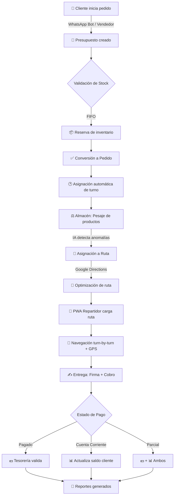

# 📋 Product Requirements Document (PRD)

## **Avícola del Sur ERP**

---

| Campo | Valor |
|-------|-------|
| **Proyecto** | Avícola del Sur ERP |
| **Fecha** | 2025-12-30 |
| **Preparado por** | TestSprite & Sistema de Documentación |
| **Versión** | 1.0 |

---

## 📖 Descripción General del Producto

**Avícola del Sur ERP** es un sistema de planificación de recursos empresariales (ERP) modular de extremo a extremo, diseñado específicamente para la industria avícola. Integra dominios clave incluyendo:

- **WMS** (Gestión de Almacén)
- **CRM** (Gestión de Ventas)
- **TMS** (Gestión de Transporte)
- **Tesorería**
- **Gestión Multi-Sucursal**
- **Recursos Humanos**

El sistema presenta sincronización de datos en tiempo real, operaciones mejoradas con IA, seguimiento de entregas habilitado por GPS, enrutamiento automatizado y experiencias de usuario fluidas tanto para escritorio como para móvil (PWA).

---

## 🎯 Objetivos Core

| # | Objetivo |
|---|----------|
| 1 | Proporcionar una **fuente única de verdad** unificada para todos los datos operacionales usando Supabase como backend. |
| 2 | **Automatizar flujos de trabajo** empresariales de extremo a extremo desde la colocación de pedidos hasta la reconciliación de pagos. |
| 3 | Asegurar un **control de acceso robusto basado en roles** con seguridad estricta a nivel de fila (RLS) para privacidad e integridad de datos. |
| 4 | **Optimizar la logística de entregas** mediante generación automática de rutas y optimización impulsada por IA. |
| 5 | Ofrecer **monitoreo y seguimiento en tiempo real** de entregas con GPS y alertas para garantizar servicio oportuno. |
| 6 | Soportar **operaciones multi-sucursal** con inventario distribuido, control financiero individual por sucursal y transferencias entre sucursales. |
| 7 | Integrar **inteligencia artificial (Google Gemini AI)** para mejorar la toma de decisiones incluyendo detección de anomalías, predicción de riesgo de clientes y clasificación automática de gastos. |
| 8 | Facilitar la **facilidad de uso** a través de aplicaciones web responsivas, una PWA para personal de entrega y un chatbot de WhatsApp para gestión de pedidos sin esfuerzo. |
| 9 | Mantener **consistencia e integridad de datos** a través de Server Actions centralizadas y transacciones de base de datos atómicas. |
| 10 | Habilitar **capacidades completas de reportes y exportación** para datos operacionales, financieros y de RRHH. |

---

## ✨ Características Clave

### 🔐 Autenticación y Seguridad
- Sistema de autenticación con JWT y 6 roles de usuario definidos
- Control de acceso basado en roles (RBAC)
- Seguridad a nivel de fila (RLS) estricta

### 📊 Dashboard
- Métricas y KPIs en tiempo real
- Ventas, pedidos y alertas de entrega
- Widgets de IA con predicciones y riesgos

### 📦 Gestión de Almacén (WMS)
- CRUD completo de productos con configuración de precios
- Seguimiento de lotes con FIFO automático
- Transformaciones de productos (producción/desposte)
- Trazabilidad completa desde proveedor hasta entrega

### 👥 CRM - Gestión de Clientes
- Límites de crédito y zonas de entrega
- Bloqueo automático por deuda
- Listas de precios personalizadas
- Cuenta corriente con historial de movimientos

### 💰 Presupuestos y Facturación
- Sistema de cotización con conversión automática a pedidos
- Asignación automática de turnos/horarios
- Facturación con estados de pago y cálculo de moras
- Múltiples listas de precios con márgenes configurables

### 🚚 Gestión de Transporte (TMS)
- Creación automática de rutas
- Asignación automática de vehículo y repartidor
- Optimización con Google Directions API
- Monitor GPS en tiempo real con polylines y alertas

### 📱 PWA para Repartidores
- Hoja de ruta digital
- Navegación con instrucciones de voz
- Tracking GPS cada 5 segundos
- Registro de entregas con firma digital
- Manejo de cobros múltiples estados

### 🏢 Multi-Sucursales
- Inventarios independientes por sucursal
- Alertas de stock automáticas
- POS con control de listas de precios
- Transferencias entre sucursales
- Tesorería por sucursal

### 🤖 Bot WhatsApp
- Integración Twilio sin Botpress
- Validación de stock en tiempo real
- Creación automática de presupuestos
- Confirmación interactiva de pedidos

### 🧠 Inteligencia Artificial (Gemini)
- Detección de peso anómalo en pesaje
- Clasificación automática de gastos
- Alertas de clientes en riesgo
- Predicción de stock
- Detección de fraude en cobros

### 👔 Recursos Humanos
- Gestión de empleados completa
- Control de asistencia
- Liquidaciones automáticas
- Adelantos con límites
- Evaluaciones y novedades

### 📈 Reportes
- Exportación a CSV y PDF profesional
- Métricas de ventas, gastos, rutas
- Reportes de RRHH

---

## 🔄 Resumen del Flujo de Usuario

### Pasos Detallados:

1. **Inicio de Pedido**: Cliente contacta vía WhatsApp o vendedor crea presupuesto
2. **Validación de Stock**: Sistema valida usando lotes FIFO y reserva inventario
3. **Conversión Atómica**: Presupuesto se convierte a pedido con asignación automática de turno
4. **Descuento de Stock**: Inventario se actualiza siguiendo principios FIFO
5. **Pesaje en Almacén**: Personal pesa productos con detección de anomalías por IA
6. **Asignación de Ruta**: Pedido asignado a ruta con vehículo/repartidor automático + optimización Google
7. **Carga en PWA**: Repartidor recibe ruta con navegación y voz en español
8. **Entrega y Cobro**: Registro de firma digital y estado de pago
9. **Validación Tesorería**: Tesorero valida cobros y registra movimientos de caja
10. **Reportes**: Sistema genera reportes automáticos en CSV/PDF

---

## ✅ Criterios de Validación

### Transacciones y Datos
- [ ] Todas las operaciones críticas implementadas vía Server Actions con transacciones atómicas
- [ ] Seguridad a nivel de fila (RLS) aplicada en todas las tablas
- [ ] Consistencia de datos verificada en operaciones concurrentes

### Rutas y Entregas
- [ ] Asignación automática de rutas sin exceder capacidad de vehículos
- [ ] Google Directions API con manejo graceful de errores
- [ ] GPS tracking cada 5 segundos con actualización en monitor

### Pagos y Tesorería
- [ ] Clasificación correcta de estados de pago
- [ ] Reflejo preciso en módulos de tesorería
- [ ] Cálculo correcto de moras y saldos

### IA y Servicios
- [ ] Latencia aceptable en endpoints de IA
- [ ] Detección precisa de anomalías y clasificaciones

### Multi-Sucursal
- [ ] Segregación correcta de datos por sucursal
- [ ] Control independiente de inventario y tesorería

### Reportes y UI
- [ ] Exportación correcta a CSV y PDF
- [ ] Notificaciones con filtros y badges actualizados
- [ ] Cobertura end-to-end desde pedido hasta reconciliación

---

## 🛠️ Stack Tecnológico

| Categoría | Tecnología |
|-----------|------------|
| **Lenguaje** | TypeScript |
| **Framework** | Next.js 15 (App Router) |
| **UI Library** | React 19 |
| **Estilos** | Tailwind CSS |
| **Componentes** | shadcn/ui |
| **Backend/DB** | Supabase (PostgreSQL + Auth + Storage + Realtime) |
| **Estado Global** | Zustand |
| **Formularios** | React Hook Form + Zod |
| **Tablas** | TanStack Table |
| **Mapas** | Google Maps JavaScript API + Leaflet/OpenStreetMap |
| **Optimización Rutas** | Google Directions API |
| **IA** | Google Gemini AI |
| **Chat Bot** | Twilio WhatsApp |
| **PDF** | PDFKit |

---

## 📁 Módulos del Sistema

### Autenticación y Roles
Sistema de autenticación con JWT usando Supabase Auth. 6 roles principales: admin, vendedor, encargado_sucursal, repartidor, almacenista, tesorero. RLS estricto por tabla/rol.

### Dashboard Principal
Panel de control administrativo con métricas en tiempo real, KPIs de ventas, pedidos pendientes, entregas del día y alertas.

### Gestión de Productos
CRUD completo de productos con código, precios, stock, unidades de medida, venta mayorista configurable y peso por unidad mayor.

### Control de Lotes (WMS)
Gestión de lotes con trazabilidad completa, fechas de vencimiento, proveedor y sistema FIFO automático para descuento de stock.

### Producción/Desposte
Sistema de transformación de productos (cajas de pollo → filet, patamuslo, etc.) con destinos configurables, mermas y desperdicio calculado.

### Gestión de Clientes (CRM)
CRUD de clientes con zonas de entrega, límites de crédito, bloqueo automático por deuda, listas de precios asignadas y cuenta corriente.

### Presupuestos y Cotizaciones
Creación de presupuestos con tipo de venta (Reparto/Retira), selección de lista de precios, conversión a pedidos y turnos automáticos.

### Listas de Precios
Sistema completo de listas (minorista, mayorista, distribuidor) con margen de ganancia configurable, vigencia opcional y precios manuales por producto.

### Gestión de Pedidos
Pedidos agrupados por turno/zona/fecha con entregas individuales, estados completos, referencias de pago y pesaje obligatorio.

### Facturación
Gestión de facturas con estados de pago (pendiente, parcial, pagada, anulada), saldo pendiente automático, sistema de moras y vencimientos.

### Rutas de Reparto (TMS)
Gestión de rutas con asignación automática de vehículo/repartidor, optimización con Google Directions API y capacidad por vehículo.

### Monitor GPS
Panel de tracking en tiempo real con ubicaciones de repartidores, polylines siguiendo calles, alertas de desvío y panel lateral de clientes.

### PWA Repartidor
Aplicación móvil para repartidores con hoja de ruta digital, navegación con voz, GPS tracking, registro de entregas y cobros.

### Gestión de Cobros
Registro de pagos durante reparto con estados (pagado, cuenta corriente, parcial, pendiente, rechazado), firma digital y comprobantes.

### Tesorería - Cajas
Control de cajas por sucursal con saldos, movimientos de ingreso/egreso, cierres de caja y validación de cobros.

### Sistema de Moras
Gestión de clientes morosos con cálculo automático de moras, días de gracia, porcentaje mensual y badges de urgencia.

### Gestión de Gastos
Registro de gastos con clasificación automática por IA (Gemini), categorías y movimientos de caja asociados.

### Módulo Multi-Sucursales
Gestión de sucursales con inventario distribuido, alertas de stock automáticas, tesorería independiente y transferencias entre sucursales.

### POS Sucursal
Punto de venta para sucursales con control de listas de precios, recargos por método de pago y auditoría de ventas.

### Bot WhatsApp
Chatbot automatizado via Twilio para recibir pedidos, validar stock en tiempo real, crear presupuestos y confirmar pedidos.

### Inteligencia Artificial (Gemini)
Múltiples funcionalidades IA: detección de peso anómalo, clasificación de gastos, clientes en riesgo, predicción de stock y validación de cobros.

### RRHH - Empleados
CRUD completo de empleados con datos personales, laborales, bancarios, asistencia, liquidaciones y adelantos.

### Sistema de Notificaciones
Notificaciones centralizadas con filtros, selección múltiple, acciones masivas, configuración por categoría y push notifications.

### Reportes y Exportación
Generación de reportes en CSV y PDF profesional con pdfkit, métricas de ventas, gastos, movimientos y rutas.

### Google Maps Integration
Selector interactivo de ubicaciones, autocompletado de direcciones con Places API y geocoding bidireccional.

### Vehículos
Gestión de flota de vehículos con marca, modelo, patente, capacidad en kg y asignación de repartidores.

### Transferencias entre Sucursales
Solicitudes de envío de productos entre sucursales con trazabilidad completa y actualización de inventarios.

---

## 📎 Documentos Relacionados

- [ARCHITECTURE_SUMMARY.md](./ARCHITECTURE_SUMMARY.md) - Resumen ejecutivo de arquitectura
- [ARCHITECTURE.MD](./ARCHITECTURE.MD) - Arquitectura técnica detallada
- [README.md](./README.md) - Guía de inicio rápido
- [TESTING.md](./TESTING.md) - Guía de pruebas

---

*Documento generado automáticamente por TestSprite y sistema de documentación de Avícola del Sur ERP*
