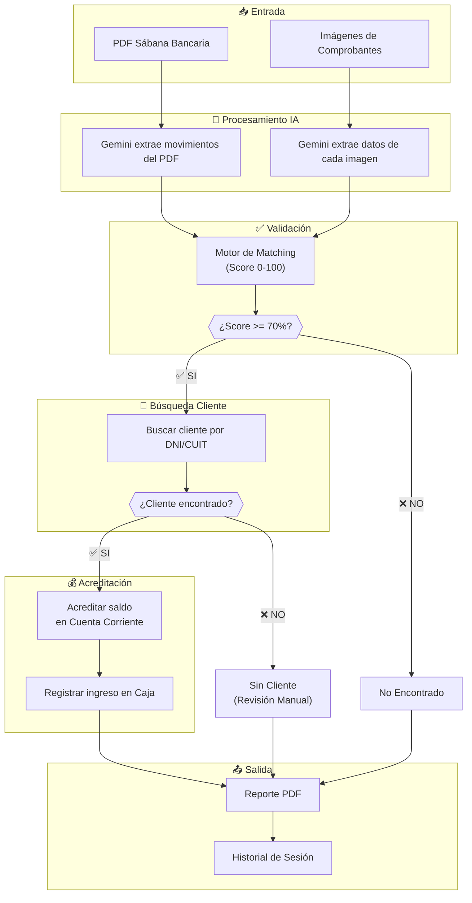
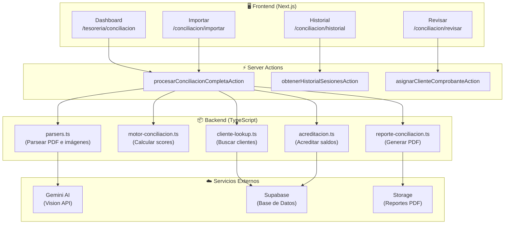

# 🏦 Sistema de Conciliación Bancaria con IA

## Introducción

El **Sistema de Conciliación Bancaria con IA** es un módulo avanzado del ERP de Avícola del Sur que automatiza el proceso de verificación y acreditación de pagos de clientes.

Este documento explica cómo funciona el sistema, qué puede hacer, y cómo beneficia a la operación diaria.

---

## 🎯 ¿Qué Problema Resuelve?

Antes de este sistema, el proceso de conciliación era:

1. ❌ Recibir comprobantes de pago por WhatsApp
2. ❌ Revisar manualmente el extracto bancario
3. ❌ Buscar cada transferencia en la "sábana"
4. ❌ Identificar a qué cliente corresponde
5. ❌ Registrar manualmente el pago en la cuenta corriente

**Ahora, con el nuevo sistema:**

1. ✅ Subir el PDF del extracto bancario
2. ✅ Subir todas las imágenes de comprobantes
3. ✅ El sistema hace todo automáticamente
4. ✅ Genera un reporte PDF con el resultado

---

## 📊 Diagrama del Flujo de Conciliación



---

## 🏗️ Arquitectura del Sistema



---

## ⚙️ Características Principales

### 1. 📄 Procesamiento de Sábana Bancaria

- **Formato soportado**: PDF
- **IA utilizada**: Gemini 1.5 Flash
- **Datos extraídos**:
  - Fecha de operación
  - Monto
  - Referencia/número de operación
  - DNI/CUIT del ordenante
  - Descripción

### 2. 🖼️ Procesamiento de Comprobantes

- **Formatos soportados**: PNG, JPG, JPEG, WEBP
- **Procesamiento por lotes**: 5 imágenes en paralelo
- **Datos extraídos**:
  - Monto de la transferencia
  - DNI/CUIT del pagador
  - Número de referencia
  - Fecha de operación

### 3. 🎯 Motor de Matching Inteligente

El sistema calcula un **score de coincidencia** (0-100) basado en:

| Criterio | Puntos |
|----------|--------|
| Monto exacto (diferencia < $1) | 50 |
| Monto aproximado (≤ 2%) | 40 |
| DNI/CUIT coincide | 35 |
| Misma fecha | 15 |
| Referencia muy similar | 15 |

**Umbral de auto-validación**: 70 puntos

### 4. 👤 Búsqueda Automática de Clientes

- Busca por **DNI o CUIT** en la base de datos de clientes
- Soporta formatos: `20123456789`, `20-12345678-9`
- Si no encuentra cliente, marca como **"Sin Cliente"** para revisión manual

### 5. 💰 Acreditación Automática

Cuando se valida un comprobante con cliente:
- Crea un movimiento de tipo **"Abono"** en la cuenta corriente
- Actualiza el saldo del cliente
- Registra el ingreso en la caja central

### 6. 📊 Generación de Reportes

Cada sesión genera un **PDF** con:
- Resumen de la conciliación
- Total de comprobantes procesados
- Cantidad validados / no encontrados / sin cliente
- Monto total acreditado
- Detalle de cada comprobante

---

## 🖥️ Pantallas del Sistema

### Dashboard Principal
**Ruta**: `/tesoreria/conciliacion`

- Estadísticas generales
- Tasa de éxito histórica
- Monto total acreditado
- Historial reciente
- Botón "Nueva Conciliación"

### Importar Conciliación
**Ruta**: `/tesoreria/conciliacion/importar`

- Dropzone para PDF de sábana
- Dropzone para múltiples imágenes
- Vista previa de archivos seleccionados
- Barra de progreso durante el procesamiento
- Resultado con cards de resumen

### Revisar Comprobantes
**Ruta**: `/tesoreria/conciliacion/revisar?sesion=ID`

- Resumen de la sesión
- Tabla de comprobantes con filtros
- Botones de acción:
  - "Asignar Cliente" (para sin cliente)
  - "Descartar" (para errores)
- Score de confianza por comprobante

### Historial de Sesiones
**Ruta**: `/tesoreria/conciliacion/historial`

- Lista agrupada por mes
- Estadísticas por sesión
- Descarga de reportes PDF

---

## 📁 Estructura de Archivos

```
src/
├── actions/
│   └── conciliacion.actions.ts      # Server actions
├── app/tesoreria/conciliacion/
│   ├── page.tsx                      # Dashboard
│   ├── importar/page.tsx             # Importación
│   ├── revisar/page.tsx              # Revisión
│   └── historial/page.tsx            # Historial
├── lib/conciliacion/
│   ├── parsers.ts                    # Parseo PDF + imágenes
│   ├── motor-conciliacion.ts         # Match scoring
│   ├── cliente-lookup.ts             # Búsqueda clientes
│   ├── acreditacion.ts               # Acreditación saldos
│   ├── reporte-conciliacion.ts       # Generación PDF
│   └── utils.ts                      # Utilidades
└── types/
    └── conciliacion.ts               # Tipos TypeScript
```

---

## 🗄️ Base de Datos

### Tabla: `sesiones_conciliacion`

| Campo | Tipo | Descripción |
|-------|------|-------------|
| id | UUID | Identificador único |
| fecha | timestamp | Fecha de la sesión |
| sabana_archivo | text | Nombre del PDF |
| total_comprobantes | int | Cantidad de imágenes |
| validados | int | Comprobantes exitosos |
| no_encontrados | int | No encontrados en sábana |
| monto_total_acreditado | decimal | Suma acreditada |
| usuario_id | UUID | Quién ejecutó |
| reporte_url | text | URL del PDF |
| estado | enum | en_proceso / completada / con_errores |

### Tabla: `comprobantes_conciliacion`

| Campo | Tipo | Descripción |
|-------|------|-------------|
| id | UUID | Identificador único |
| sesion_id | UUID | Sesión a la que pertenece |
| monto | decimal | Monto del comprobante |
| dni_cuit | text | DNI/CUIT extraído |
| estado_validacion | enum | validado / no_encontrado / sin_cliente / error |
| cliente_id | UUID | Cliente vinculado |
| confianza_score | decimal | Score de matching (0-1) |
| acreditado | boolean | Si ya se acreditó |
| origen | enum | manual / sucursal / whatsapp |

---

## 🚀 Preparado para el Futuro

El sistema está diseñado para integrarse con:

1. **📍 Sucursales**: Las sucursales podrán subir comprobantes directamente
2. **📱 Bot de WhatsApp**: Los clientes podrán enviar comprobantes por WhatsApp y el sistema los procesará automáticamente

Los campos `origen` y `sucursal_origen_id` ya están preparados en la base de datos.

---

## 📈 Beneficios

| Antes | Después |
|-------|---------|
| 2-3 horas de trabajo manual | 5 minutos con el sistema |
| Errores humanos frecuentes | Validación automática precisa |
| Sin registro histórico | Historial completo con reportes |
| Proceso tedioso | Proceso simple y guiado |
| Sin visibilidad de estado | Dashboard con estadísticas |

---

## 📞 Soporte

Para consultas sobre el sistema de conciliación bancaria, contactar al equipo de desarrollo.

---

*Documento generado automáticamente - Avícola del Sur ERP v2.0*
