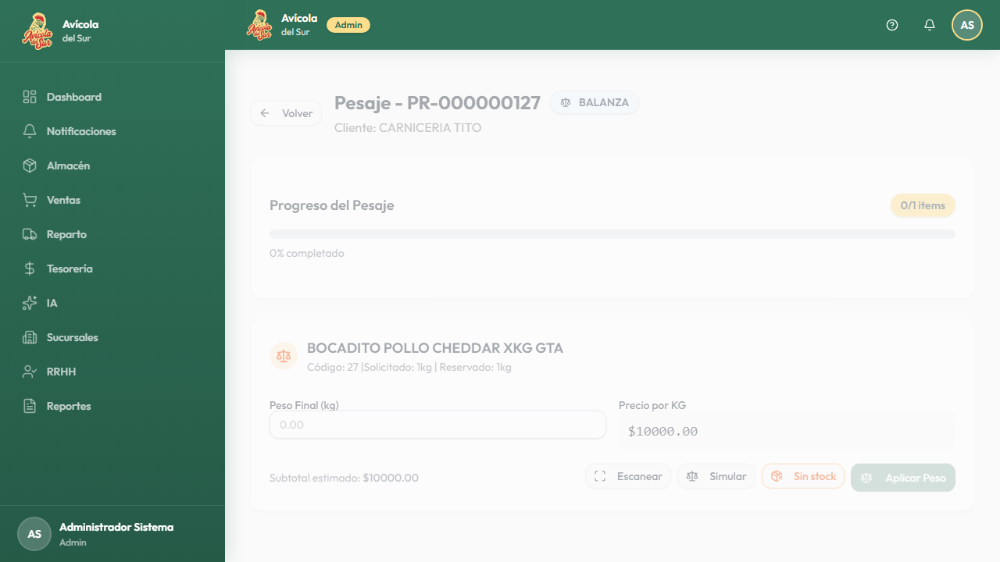
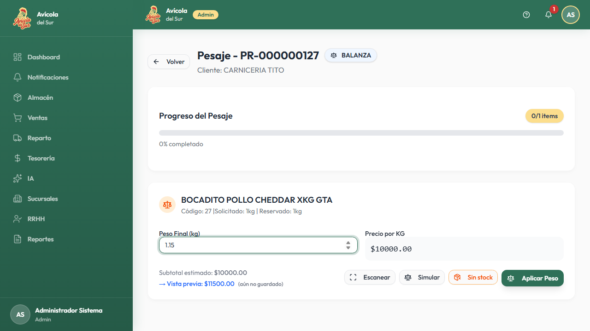
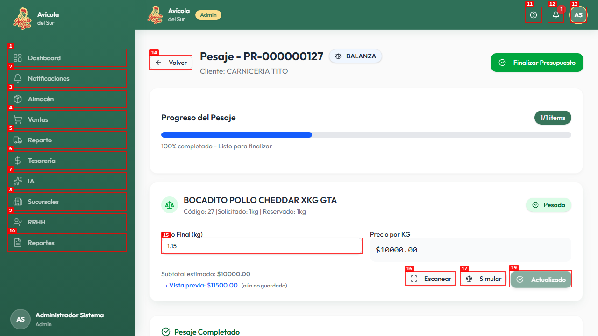
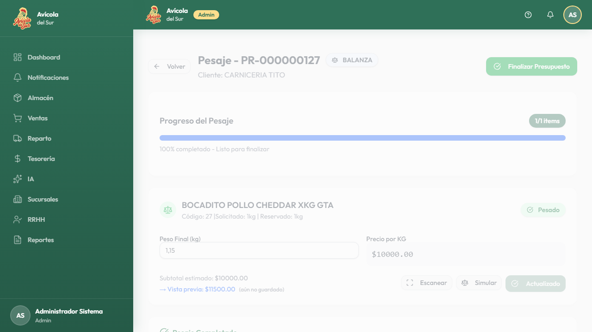
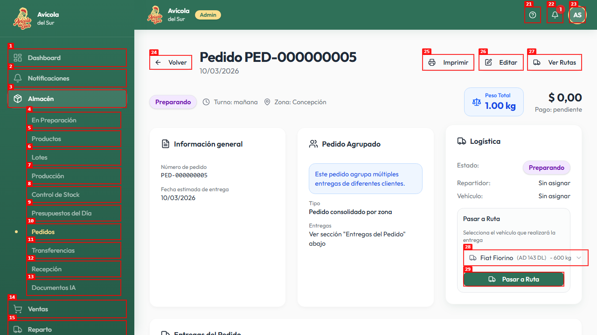
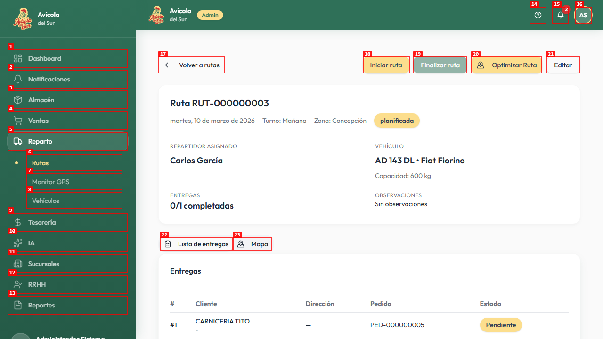
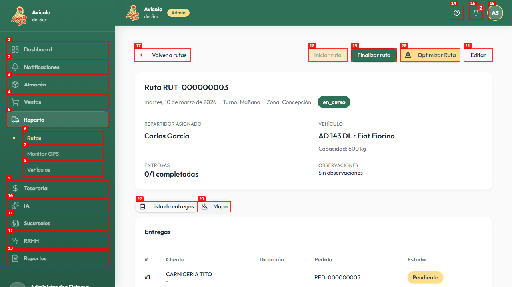
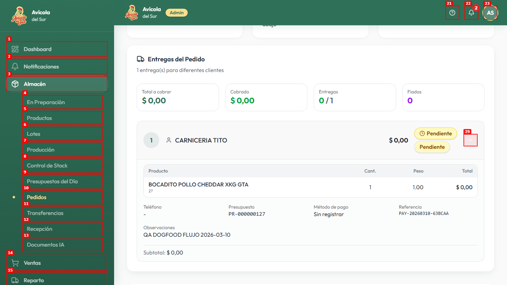
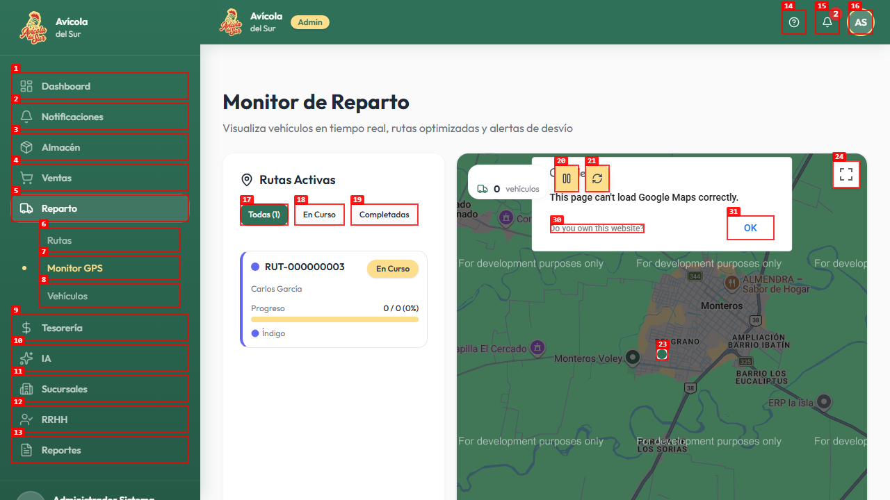
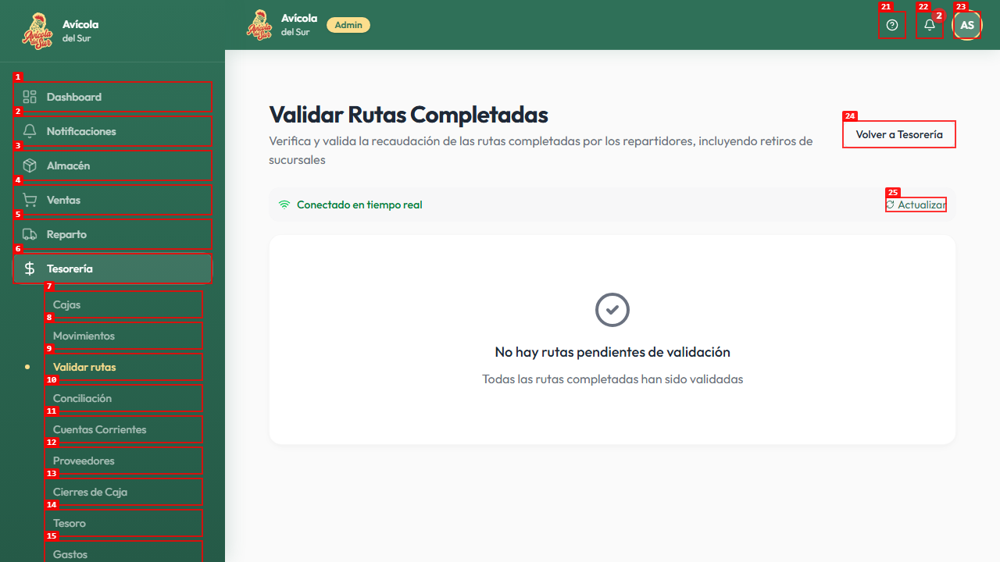

# Dogfood Report: Avícola del Sur ERP

| Field | Value |
|-------|-------|
| **Date** | 2026-03-10 |
| **App URL** | https://avicoladelsur.vercel.app/ |
| **Session** | avicola-e2e-flow2 |
| **Scope** | Flujo completo Presupuesto -> Almacén -> Reparto -> Tesorería en producción |

## Summary

| Severity | Count |
|----------|-------|
| Critical | 0 |
| High | 2 |
| Medium | 0 |
| Low | 0 |
| **Total** | **2** |

## Issues

<!-- Copy this block for each issue found. Interactive issues need video + step-by-step screenshots. Static issues (typos, visual glitches) only need a single screenshot -- set Repro Video to N/A. -->

### ISSUE-001: La conversión desde pesaje crea un pedido con total $ 0,00

| Field | Value |
|-------|-------|
| **Severity** | high |
| **Category** | functional |
| **URL** | https://avicoladelsur.vercel.app/almacen/presupuesto/7f348d39-1f6b-4c5f-90d9-06a4cdc6a40a/pesaje |
| **Repro Video** | videos/flow-convertir-pr-000000127.webm |

**Description**

Después de pesar `PR-000000127`, la pantalla de pesaje muestra una vista previa de `$11500.00` para el item pesado a `1.15 kg`, pero al convertir el presupuesto a pedido el sistema genera `PED-000000005` con `Precio unitario $ 0,00`, `Subtotal $ 0,00`, `Total a cobrar $ 0,00` y `Pago: pendiente`. Se esperaba que el monto final pesado se propagara al pedido para poder continuar el circuito normal de reparto y cobranza.

**Repro Steps**

<!-- Each step has a screenshot. A reader should be able to follow along visually. -->

1. Navegar a la pantalla de pesaje del presupuesto `PR-000000127`.
   

2. Ingresar `1.15` en `Peso Final (kg)` y aplicar el peso.
   

3. Confirmar que la pantalla de pesaje muestra `100% completado` y habilita `Convertir a Pedido y Finalizar`.
   

4. Hacer clic en `Convertir a Pedido y Finalizar`.
   

5. **Observar:** el pedido `PED-000000005` se crea con monto total `$ 0,00` y total a cobrar `$ 0,00`, en lugar de reflejar el importe pesado.
   

---

### ISSUE-002: La ruta queda en reparto pero no habilita completar entrega, cobrar ni llegar a Tesorería

| Field | Value |
|-------|-------|
| **Severity** | high |
| **Category** | functional |
| **URL** | https://avicoladelsur.vercel.app/reparto/rutas/47645684-8087-4074-9414-36949ec25154 |
| **Repro Video** | videos/flow-iniciar-ruta-rut-000000003.webm |

**Description**

Después de enviar `PED-000000005` a `RUT-000000003`, la ruta puede iniciarse y queda `en_curso`, pero el flujo se corta antes de la cobranza. En el detalle de la ruta sigue habiendo `0/1 entregas completadas`; la entrega expandida de `CARNICERIA TITO` sólo muestra datos y subtotal `$ 0,00`, sin ninguna acción visible para completar la entrega o registrar cobro; el `Monitor GPS` muestra la ruta `En Curso` con progreso `0 / 0`; y `Tesorería > Validar rutas` no recibe ninguna ruta para validar, por lo que tampoco aparecen movimientos de caja del caso. Se esperaba poder completar la entrega, registrar el cobro y luego validar la ruta en tesorería.

**Repro Steps**

1. Abrir el detalle de la ruta `RUT-000000003`, generada desde el pedido `PED-000000005`.
   

2. Hacer clic en `Iniciar ruta` y verificar que el estado pase a `en_curso`.
   

3. Revisar la lista de entregas y expandir la entrega de `CARNICERIA TITO`.
   

4. Abrir `Reparto > Monitor GPS` y observar que la misma ruta aparece `En Curso` con progreso `0 / 0`, como si no tuviera entregas operables.
   

5. Abrir `Tesorería > Validar rutas` y observar que no aparece ninguna ruta pendiente de validación; luego abrir `Tesorería > Movimientos` y ver que no hay recaudación ni movimientos registrados del caso.
   

---
